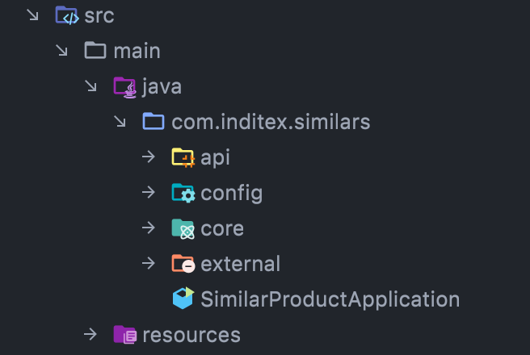

# Hexagonal Architecture with DDD
This mini-project is a very little example of a hexagonal architecture. This project is the implementation of the solution to the problem raised in the repository: https://github.com/dalogax/backendDevTest. The solution is available in two paradigms: imperative and reactive.


## How to Install and Run the Project

First of all, you need to build the image associated with the new service. You should have installed the docker framework and exec the next command: 

```bash
docker build -t similarproducts .
```

And after that, you should navigate to the backendDevTest folder and invoke the next command:

```bash
docker-compose up -d simulado influxdb grafana similarproducts
```

If everything went well, you will be able to invoke to the following command (just to see performance results):

```bash
docker-compose run --rm k6 run scripts/test.js
```

Finally, you will see the tests result on: [Grafana Dashboard](http://localhost:3000/d/Le2Ku9NMk/k6-performance-test?orgId=1)

## Technical Design

First at all, I tried to design an hexagonal architecture based project. I've created a **Product** root where I defined its own functionality (always abstracted on an interface for versionating purposes) and attributes.

### Project Packaging Structure

If you go down on the project, you will see four root packages:



- **api**: This package will be in charge of being the own of the entrypoint. Here is where I defined every logic related to the REST controller (its DTOs, its mapper, etc.). If we want to add more behavior to the entrypoint (Spring Security, Validators, ...) we should place it inside this root package.
- **config**: This package will be in charge of defining every bean of the application. I defined the Hazelcast instance for cache purposes, every bean for third parties communications, ...
- **core**: This package is in charge of containing every behavior adherent to the domain logic (model definition, exception classes, services exposed, ...)
- **external**: This package is in charge of containing every third party client logic, database repositories, ...
